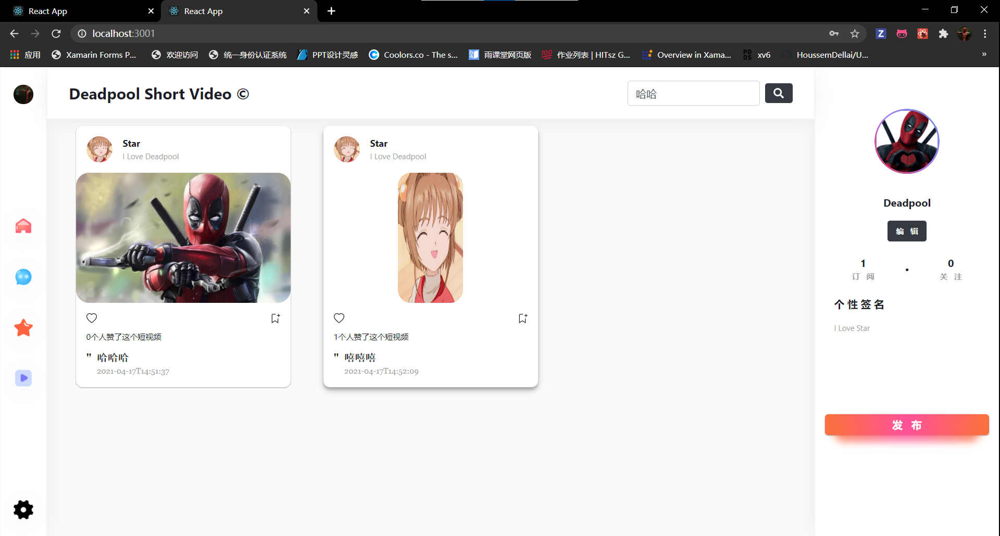
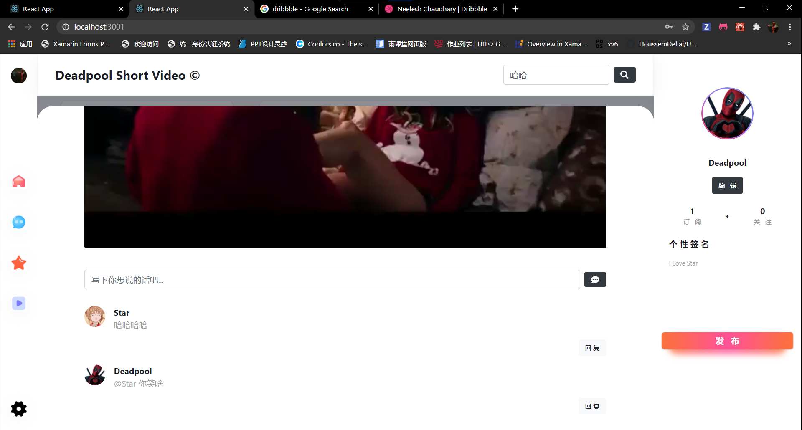
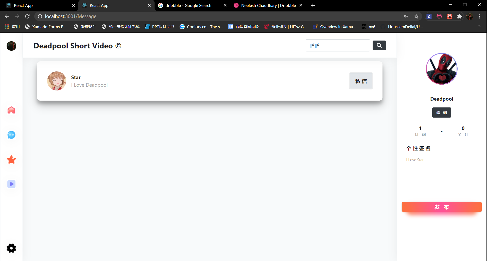
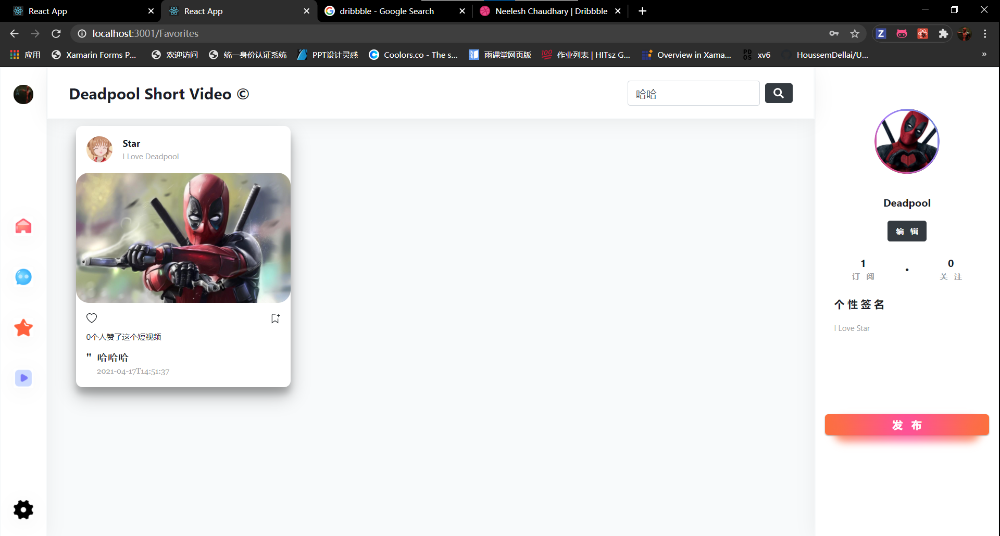
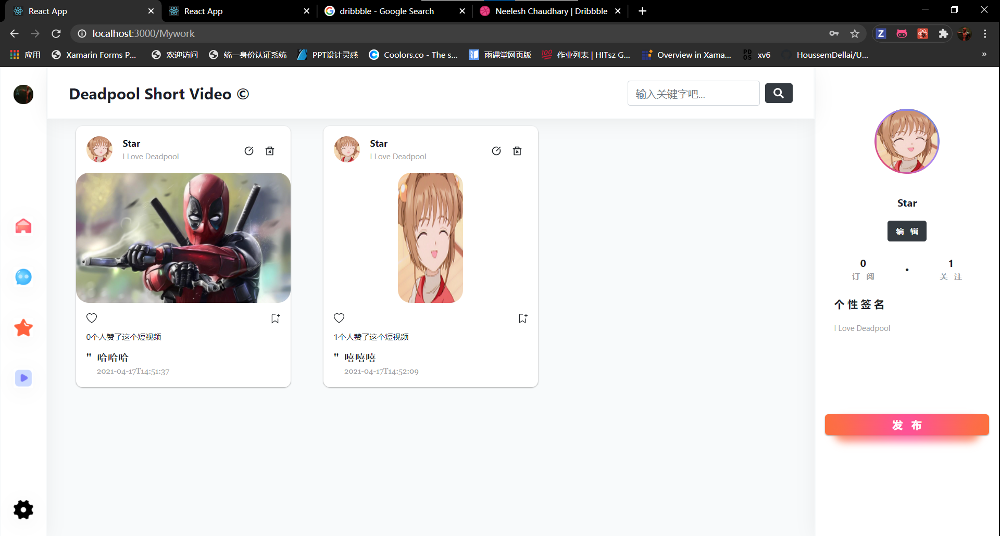
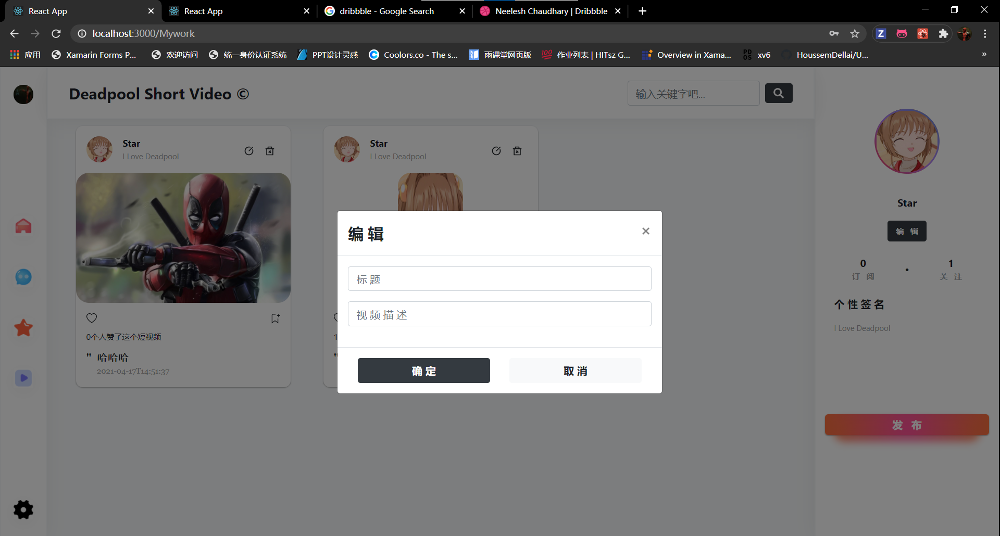
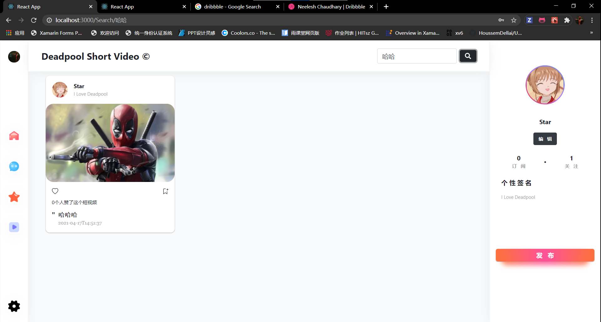
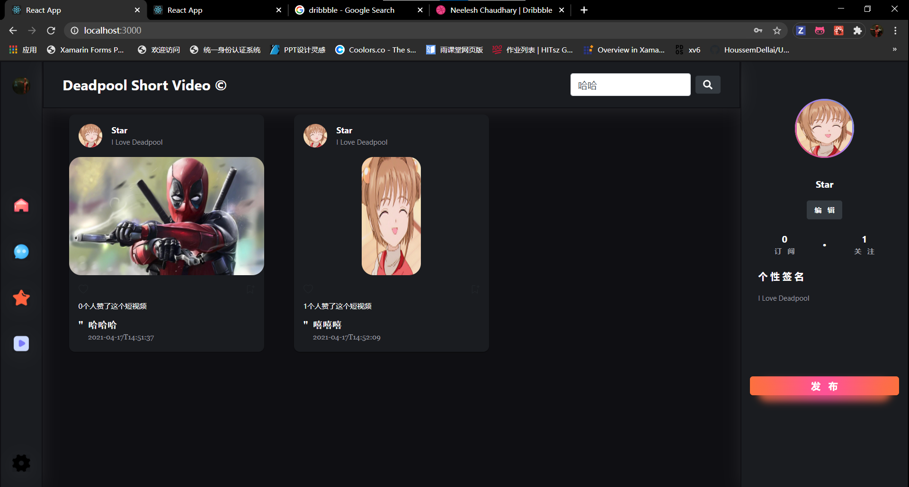
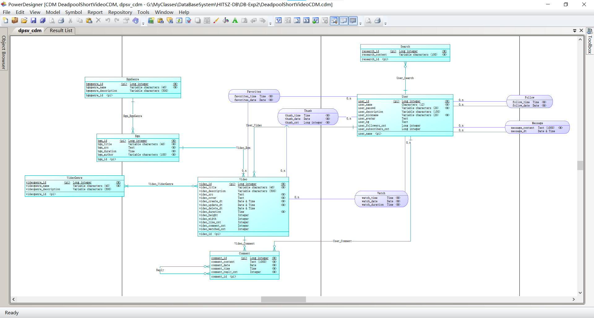

# DPSV

> DPSV is a abbreviation of Deadpool Short Video, it's our Database System class project, Enjoy Yourself 👏！

## Description

DPSV is developed by `Flask + React + MySQL`, and inspired by [Neelesh Chaudhary](https://dribbble.com/shots/15118067-Instagram) 

## Features

### Home

### Details

### Comments

### Private Messages

### My Favorites

### My Works

### Search

### Theme

## DB Design

[Check out here](./design), to open this, you need first download [power designer](https://www.google.com.hk/search?q=powerdesigner&oq=power&aqs=chrome.2.69i57j46i275j69i59j35i39j0l2j0i67j46i67j0i67j0.2229j0j15&sourceid=chrome&ie=UTF-8)

Hope you like it 😄👏

